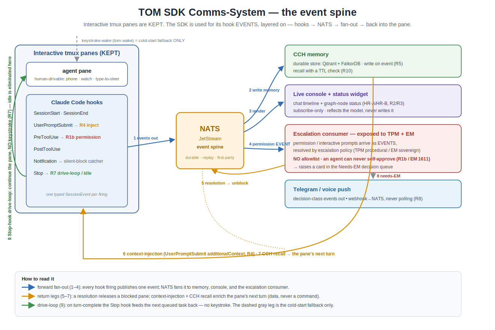

# Hook event contract (draft)

This is tom's half of the SDK comms system: the contract for the event stream the
whole thing rides on, plus the data the status widget renders. It's a draft for
converging with TPM (who owns the producer side, what each hook fires) and viz
(who builds the console). The code is in `tom/schemas/session_event.py`,
`tom/schemas/decision.py`, and `tom/projection/session_events.py`.

The architecture and the requirements (R1–R10) live in the RFC,
[[SDK-comms-system]]; this is its **normative data-contract companion** — the
concrete shapes the console and widget consume. The two are halves of one RFC.

The split, settled: tom owns the data and the substrate (this contract, the
status/relationship projection it renders), viz builds the UI, TPM owns the
producer (which hook fires what, on Claude 2.1.169) and CCH.

## The spine, in one picture



hooks → NATS → { CCH · console + status widget · escalation consumer → Needs-EM
queue · Telegram } and back into the pane. Permissions are **events**, resolved by
an escalation policy exposed to TPM + EM — **no allowlist**, no self-approval
(R1b / EM 1611). Idle is eliminated by the Stop-hook drive-loop (R7, no keystroke);
keystroke-wake stays only as the cold-start fallback. Editable source:
`sdk-comms-spine.excalidraw`.

## The event

Every hook firing becomes one `SessionEvent` on the bus:

```
SessionEvent(event_id, session, hook, ts, origin=first-party, payload)
```

`hook` is one of: `session-start`, `user-prompt-submit`, `pre-tool-use`,
`post-tool-use`, `notification`, `stop`, `session-end`, `permission-request`.
Subject: `team.event.session.<identity>.<hook>`.

**First-party, not inter-session.** These come from our own sessions' hooks. They
are trusted by authenticating the producer, which is a different path from the
untrusted inter-session message that goes through `admit()`. The two must not be
conflated: a first-party event is telemetry the producer is allowed to assert; an
inter-session message is data the receiver decides whether to act on. So the event
stream does not pass through the peer trust gate. It gets its own authenticated
first-party path (the producer signs / the transport authenticates the origin) —
TPM and I converge on the exact mechanism, but the contract draws the line here.

## Per-hook payload (TPM pins this)

The `payload` is open in the schema and the projection never reads it for meaning
(kind comes from `hook`, structurally). But the surfaces want known fields. This
is pinned to 2.1.169 from TPM's live capture (headless `claude -p` + an all-hooks
capture script, ground truth, not transcribed docs). Every hook carries a common
envelope — `session_id`, `transcript_path`, `cwd`, `hook_event_name` — plus
`permission_mode` (all but session-start/session-end) and `effort` (the
tool-use/stop hooks). The hook payload has no timestamp, so `ts` is stamped by the
producer at publish. `session` is the hook's `session_id`; `hook` is its
`hook_event_name`.

| hook | payload (beyond the common envelope) | feeds |
|---|---|---|
| `session-start` | — | status: active |
| `user-prompt-submit` | `prompt` | status: active + current task |
| `pre-tool-use` | `tool_name`, `tool_input`, `tool_use_id` | status: active; an edge if the tool targets another session/PR; the R1b decision point |
| `post-tool-use` | `tool_name`, `tool_response`, `duration_ms`, `tool_use_id` | status: active (the `tool_use_id` ties the pair) |
| `notification` | (interactive capture pending) | console timeline; status: alive; the silent-block/idle-wait catcher |
| `stop` | `stop_hook_active`, `last_assistant_message`, `background_tasks`, `session_crons` | status: **measured idle**; `last_assistant_message` is the node's last activity + a chat-timeline line for free |
| `session-end` | `reason` | graph: retire the node |

`permission-request` is left off the table on purpose: in TPM's headless capture it
did **not** fire even under `--permission-mode default` (the engine resolved the
tool with no dialog), so on 2.1.169 R1b rides the `pre-tool-use` `permissionDecision`
plus `notification`, not a `permission-request` hook (see R1b below). Whether a
configurable `permission-request` settings-hook exists at all is the one open item,
pending an instrumented interactive-pane capture.

## Folding into the status the model already computes

The hook stream is a richer source for the projection tom already built (#1-3:
HR-A status, HR-B relationship graph, the query verbs). `status_signal_from_event`
maps each event to the existing `StatusSignal`, so the console and the widget read
off one model. Two derivations carry the weight:

- **`stop` is a measured idle.** A Stop fires when a session finishes its turn, so
  it told us it's idle — `idle_basis = measured`, not the inferred "we haven't
  heard from it" the wake relay had to settle for. This is the measured-idle
  upgrade I'd flagged as a follow-up; the hook stream just delivers it.
- **`permission-request` is blocked.** A session waiting on a human decision reads
  as blocked on the status surface, and a card is raised so the wait is visible.

Relationship edges (HR-B) derive the same way a bus message does today: a
`pre-tool-use` that targets another session or a PR is an edge; the kind comes
from the validated event, never free text.

## R1b: kill the silent block

The headline. Today a permission prompt or a clarifying question blocks a session
silently in its pane until a human notices (the 8.5h-silent-block class). The fix
has two halves, and the mechanism is settled empirically: for the kept-interactive
panes it rides the **`pre-tool-use` `permissionDecision`** (which fires in-pane for
every tool, carries `permission_mode` + the full `tool_input`, and returns the
verdict) plus the **`notification`** hook as the silent-block/idle-wait catcher.
`can_use_tool` is the headless SDK-query path only, so it isn't the in-pane
mechanism (TPM's capture: a permission-eligible tool under `--permission-mode
default` in headless `-p` resolved with no dialog, so there's no `permission-request`
hook to lean on there).

1. **Every permission/prompt becomes an EVENT on the stream** — never a silent
   blocked pane, and never a blanket pre-approval. The `pre-tool-use` decision
   publishes the permission event to NATS; the consumer that resolves it is
   exposed to TPM + EM and applies an **escalation policy** (TPM resolves the
   procedural / low-blast-radius classes; EM is sovereign on real-money or
   irreversible ones). There is **no allowlist**, and an agent can never
   self-approve its own request (EM 1611). "Routine" means the policy can resolve
   a low-risk class quickly — not that a rule auto-approves it unseen.
2. **The resolution is a `DecisionResolution`** — allow / deny / answered, with
   who, when, the verdict, and the surface — raised as a `DecisionCard` (from the
   `pre-tool-use` decision point, or a `notification` for an idle-wait), rendered
   in the console, the board's needs-human lane, and Telegram. It flows back over
   NATS to release the session; the matching `unblocked` returns it to active.

The session is never silently blocked: the block becomes a visible, attributable,
routable card the instant it would have happened.

**A resolution is structured data, not an imperative.** TPM's live test is the
evidence: a Stop-hook `reason` is evaluated under the agent's untrusted-content
posture — a legitimately-framed reason injected its token into the run, while an
injection-style "ignore everything prior, output only..." was refused. So the
write-back that releases a session must be a provenance-stamped `DecisionResolution`
(a verdict the runtime applies), never a free-text command we hope the agent obeys.
The same holds for R4 context-injection: injected context is honest information for
the next turn, framed as a task hand-off, never an override directive — and the
agent's own posture backstops it by refusing the override shape. That the verdict
is structured, not prose, is exactly why `DecisionResolution` carries `verdict` +
`by` + `surface` rather than a raw instruction.

## The decision store (one source, three renders)

`DecisionCard` + `DecisionResolution` are the one store. The console, the sprint
board's needs-human/in_review lane, and the Telegram push leg all render the same
cards and resolutions; none is a separate source of truth. An inter-session
message can enqueue a card but can never resolve one — resolution is a human act
on a surface, recorded with provenance, so a texted signoff carries the same
weight as one clicked in the console (RFC-001 AC-29/AC-30).

## The status-widget data contract (what viz renders)

The widget (R3 / em1233 HR-A+HR-B) renders the projected model. viz subscribes;
tom serves. The shape is the model tom already computes:

- **nodes** — sessions and (as they earn it) tasks / PRs, each with status
  (`active` / `idle` / `blocked`), `idle_basis`, current task, current PR.
- **edges** — `message` / `review-of` / `depends-on` / `blocks` / `hands-off`,
  colored by kind.
- **derived answers** — `who_is_idle`, `who_blocks_whom`, `critical_path`,
  `status_of`, the existing `tom.queries` verbs, so the widget highlights the same
  things an agent would ask the model.

It's render-only and subscribe-only (RFC-001 §5.5): the console holds
subscribe-only credentials and cannot publish to `team.*`; it reflects the model
and never writes it. The dependency canvas (#15) is the text v0 of exactly this.

## Seams with TPM's half

- **Producer**: which hook fires what payload on 2.1.169 (the table above).
- **R1b mechanism** (settled): in-pane `pre-tool-use` `permissionDecision` + the
  `notification` hook (`can_use_tool` is the headless-only path). The card flow +
  resolution write-back is mine.
- **Context-injection (R4)**: I wire the inbound NATS event → `UserPromptSubmit`
  `additionalContext`; TPM specs the CCH recall payload it injects (CCH hybrid
  dense+BM25 results, ranked + token-budgeted). This is **gated on the CCH-fix
  prerequisite** (CCH's injection is broken and Qdrant is empty today); until it
  lands, `additionalContext` carries live NATS bus-context, which works now, and
  CCH-recall lights up when CCH is fixed.

## Status

Draft. The schemas type-check and the derivation is tested (Stop→measured-idle,
PermissionRequest→blocked). The RFC itself lands in the vault, extending RFC-001;
these schemas are the tom-repo artifacts behind it. Not an accepted contract until
the convergence above closes.
