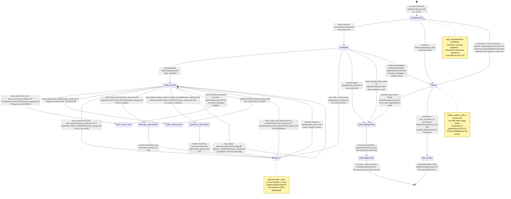
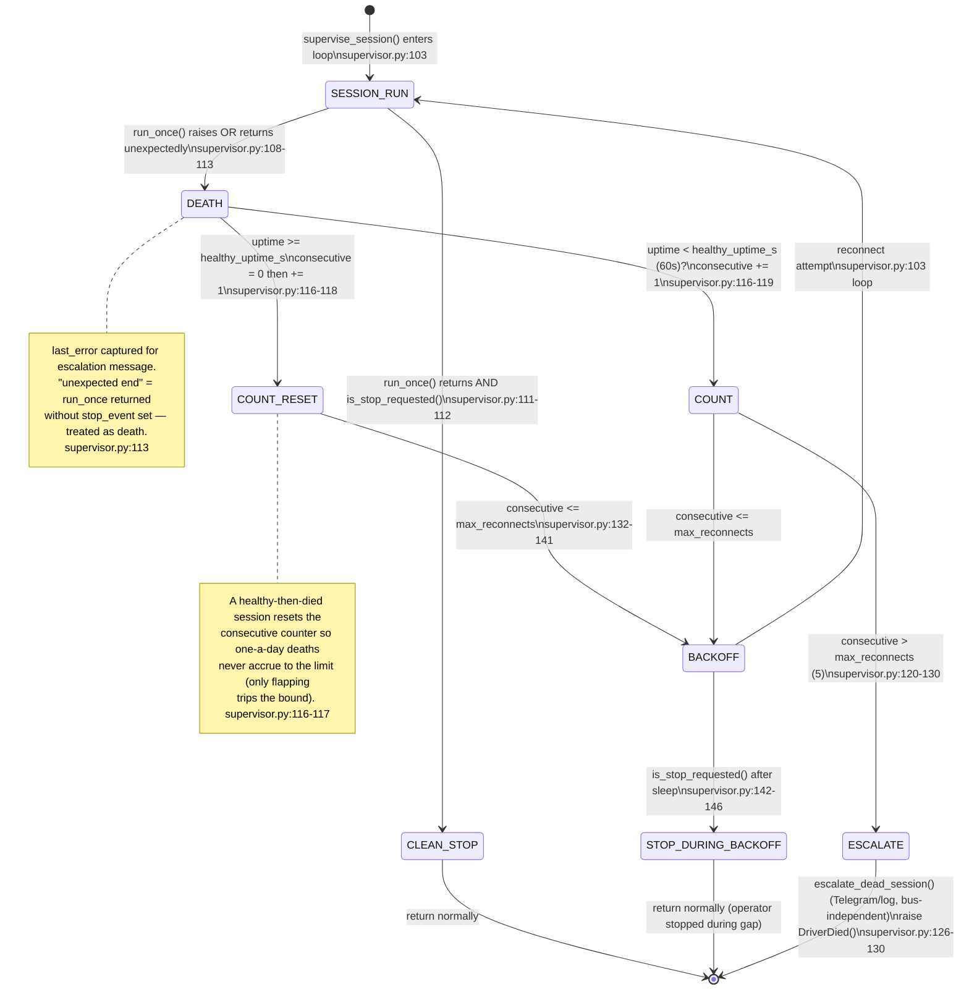

# SDK-Runtime Agent Lifecycle Diagram

Code-cited diagrams for the SDK-native peer-runtime (`sdk_runtime/`) — the WP1–WP4 assembled driver
and the `operator-attach.sh` scratch-prove harness. Gates the OA blind-attach demo.

---

## 1. Agent Lifecycle State Machine



---

## 2. Operator-Attach Flow (Sequence)

```mermaid
sequenceDiagram
    actor EM as Operator (EM)
    participant SH as operator-attach.sh
    participant TMUX as tmux (sdk-demo pane)
    participant SL as scratch_launcher.py<br/>main()
    participant RT as run_peer_runtime()<br/>runtime.py:129
    participant DRV as PeerDriver<br/>driver.py:81
    participant SDK as ClaudeSDKClient<br/>(SDK)
    participant NI as NeverIdleLoop<br/>never_idle.py:91
    participant WS as BoardWorkSource<br/>(scratch: _EmptyWorkSource)

    EM->>SH: ./operator-attach.sh

    Note over SH: Step 1 — OAuth token resolution<br/>operator-attach.sh:33-69
    SH->>SH: source _claude_account.sh (pool)<br/>operator-attach.sh:36
    alt pool empty
        SH->>SH: extract from ~/.claude-sessions/{oa,tpm,catalyst,viz}/.credentials.json<br/>operator-attach.sh:44-60
    end
    SH-->>EM: ERROR if no token found (exit 1)<br/>operator-attach.sh:63-69

    Note over SH: Step 2 — scratch CLAUDE_CONFIG_DIR<br/>operator-attach.sh:71-81
    SH->>SH: mkdir ~/.claude-sessions/operator-scratch<br/>symlink CLAUDE.md / settings.json / .mcp.json / projects

    Note over SH: Step 3 — check existing session<br/>operator-attach.sh:83-98
    SH->>TMUX: tmux has-session -t sdk-demo?
    alt --kill passed
        SH->>TMUX: tmux kill-session -t sdk-demo
    else already running
        SH-->>EM: "already running — tmux attach -t sdk-demo" (exit 0)
    end

    Note over SH: Step 4 — launch<br/>operator-attach.sh:100-128
    SH->>TMUX: tmux new-session -d -s sdk-demo<br/>-e SDK_OAUTH_TOKEN -e SDK_CONFIG_DIR<br/>-e ANTHROPIC_API_KEY="" (explicit clear, EM-8760)
    SH->>TMUX: tmux send-keys: source .venv/bin/activate &&<br/>python3 -m pm_system.sdk_runtime.scratch_launcher
    SH-->>EM: "✓ sdk-demo pane is live — tmux attach -t sdk-demo"

    EM->>TMUX: tmux attach -t sdk-demo

    Note over SL: scratch_launcher.py:63-85 main()
    SL->>SL: agent = SDK_SCRATCH_AGENT ("oa-demo")<br/>emit_hook = build_emit_hook(agent, _noop_publish)<br/>options_factory → build_runtime_options(setting_sources=[])<br/>scratch_launcher.py:63-71

    SL->>RT: run_peer_runtime(work_source=_EmptyWorkSource,<br/>operator_input=stdin_lines(), render=stdout_writer)<br/>runtime.py:129

    RT->>RT: Build NeverIdleLoop + message handler<br/>runtime.py:175-187
    RT->>RT: Create anyio task group (watch_operator_stop, pump_operator_input, supervise_session)<br/>runtime.py:209-234

    RT->>DRV: PeerDriver(client, handler)<br/>runtime.py:191

    DRV->>SDK: client.connect()<br/>driver.py:130

    SDK-->>DRV: session established

    DRV->>DRV: start task group:<br/>_consume_messages + _drain_submits<br/>driver.py:139-140

    loop Operator turn cycle
        EM->>TMUX: types a prompt + Enter
        TMUX->>RT: stdin_lines() yields line<br/>operator_io.py:114-124
        RT->>RT: pump_operator_input() reads line<br/>operator_io.py:65-78
        RT->>DRV: _submit(prompt) → driver.submit(prompt)<br/>runtime.py:169-173
        DRV->>DRV: submit_send.send(prompt)<br/>driver.py:111
        DRV->>SDK: client.query(prompt)<br/>driver.py:160

        SDK-->>DRV: streaming messages (AssistantMessage, tool results, ...)
        DRV->>RT: on_message(message) per message<br/>driver.py:153-154
        RT->>RT: render_handler: write assistant text to stdout_writer<br/>operator_io.py:81-98
        RT->>NI: build_never_idle_handler fires on ResultMessage only<br/>never_idle.py:143-157

        NI->>NI: is_result_message()? (has num_turns + stop_reason)<br/>never_idle.py:78-88
        NI->>NI: classify_stop_reason() → StopAction<br/>stop_reason.py:86-96
        NI->>WS: next_item() (scratch: returns None — operator-driven)<br/>board_work_source.py:71 / scratch: _EmptyWorkSource:45

        NI-->>RT: TurnOutcome.IDLE (no board work)<br/>never_idle.py:122-123
        RT-->>TMUX: renders trailing newline (turn separator)<br/>operator_io.py:97-98
    end

    EM->>TMUX: types /quit
    TMUX->>RT: pump_operator_input: line == "/quit"<br/>operator_io.py:69-72
    RT->>RT: stop_event.set()<br/>operator_io.py:71
    RT->>DRV: watch_operator_stop: driver.request_stop()<br/>runtime.py:199-207
    DRV->>DRV: _stop_requested = True; cancel_scope.cancel()<br/>driver.py:124-126
    DRV->>SDK: client.disconnect()<br/>driver.py:145
    DRV-->>RT: PeerDriver.run() returns

    RT->>RT: supervise_session: is_stop_requested() → True → return<br/>supervisor.py:111
    RT-->>SL: run_peer_runtime() returns normally
    SL->>SL: logger.info("SCRATCH launcher: clean stop")<br/>scratch_launcher.py:85
```

---

## 3. Supervisor Death / Reconnect Loop



---

## 4. Never-Idle Turn Decision Table

```mermaid
flowchart TD
    MSG[message arrives\ndriver._consume_messages\ndriver.py:153] --> ISRESULT{is_result_message?\nhas num_turns + stop_reason\nnever_idle.py:78}

    ISRESULT -->|No| SKIP[ignored\nnever_idle.py:153-154]

    ISRESULT -->|Yes| CLASSIFY[classify_stop_reason\nstop_reason.py:86-96]

    CLASSIFY -->|end_turn / stop_sequence| PULLFN{next_item?\nwork_source.next_item()\nnever_idle.py:120}
    CLASSIFY -->|unknown / None| WARN[WARN: unrecognised reason\nnever_idle.py:114-119] --> PULLFN

    CLASSIFY -->|tool_use / pause_turn| CONT[TurnOutcome.CONTINUING\nturn still live — NO submit\nnever_idle.py:139]

    CLASSIFY -->|max_tokens| TRUNC[submit 'continue'\nnever_idle.py:128-129\nTurnOutcome.CONTINUED_TRUNCATED]

    CLASSIFY -->|refusal| REFUSAL[on_refusal hook fires\nnever_idle.py:131-132\nTurnOutcome.RECOVERING_REFUSAL]

    CLASSIFY -->|model_context_window_exceeded| CTX[on_context_overflow hook fires\nnever_idle.py:135-136\nTurnOutcome.RECOVERING_CONTEXT]

    PULLFN -->|item returned| SUBMIT[submit item as next turn\nnever_idle.py:123-124\nTurnOutcome.SUBMITTED_NEXT]
    PULLFN -->|None — queue empty| GENUINELY_IDLE[TurnOutcome.IDLE\nawaiting external submit\nnever_idle.py:122-123]
```

---

## 5. Code Map

| Component | File | Key class / function | Role |
|---|---|---|---|
| **Driver** | `sdk_runtime/driver.py` | `PeerDriver`, `SdkClient` (Protocol), `build_client` | Owns one persistent streaming session; submit queue; clean stop vs death split |
| **StopReason table** | `sdk_runtime/stop_reason.py` | `classify_stop_reason`, `StopAction`, `KNOWN_STOP_REASONS` | Pure mapping: SDK stop_reason string → driver action; total and asserted at import |
| **Never-idle loop** | `sdk_runtime/never_idle.py` | `NeverIdleLoop`, `build_never_idle_handler`, `is_result_message` | Turn-end actuator; fires ONLY on `ResultMessage` (not AssistantMessage mid-turn) |
| **Supervisor** | `sdk_runtime/supervisor.py` | `supervise_session`, `ReconnectPolicy`, `DriverDied`, `SessionEscalator` | Bounded-retry reconnect; escalate+fail-loud after N consecutive deaths; healthy-uptime reset |
| **Runtime composer** | `sdk_runtime/runtime.py` | `run_peer_runtime`, `build_runtime_options`, `_submit_prompt` | Wires driver + loop + supervisor + operator I/O; `setting_sources=[]` blocks bash hooks |
| **Operator I/O** | `sdk_runtime/operator_io.py` | `pump_operator_input`, `render_message`, `stdin_lines`, `stdout_writer` | stdin→submit bridge; stdout render; `/quit` → stop_event |
| **Emit hook** | `sdk_runtime/emit_hook.py` | `build_emit_hook`, `handle_task_event`, `transition_to_event` | PostToolUse hook: TaskCreate/TaskUpdate → sovereign ticket event (replaces pm-todo bash hook) |
| **Board work source** | `sdk_runtime/board_work_source.py` | `BoardWorkSource`, `format_work_prompt` | Production `WorkSource`: reads board.db for agent's top actionable ticket; fail-safe on read error |
| **Operator approval** | `sdk_runtime/operator_approval.py` | `requires_operator_approval`, `verify_consent_grant`, `PubkeyResolver` | INERT WP4 foundation: deny-by-default live classifier + P-256 consent verify seam (RR-006 A1 gated) |
| **Scratch launcher** | `sdk_runtime/scratch_launcher.py` | `main()`, `_EmptyWorkSource`, `_LoggingEscalator` | Throwaway harness: no board work, noop publisher, log-only escalator — scratch-prove only |
| **operator-attach.sh** | `scripts/operator-attach.sh` | — | OAuth token resolution (pool → per-identity fallback), scratch CLAUDE_CONFIG_DIR setup, tmux launch |

---

## Key Invariants (code-grounded)

| Invariant | Where enforced |
|---|---|
| `setting_sources=[]` — bash hooks NEVER load in SDK driver | `runtime.py:118` `build_runtime_options` |
| Never-idle loop fires only on `ResultMessage` (not `AssistantMessage` mid-turn) | `never_idle.py:78-88` `is_result_message` — checks `num_turns` field unique to `ResultMessage` |
| Stop during `connect()` is not lost (durable `_stop_requested` flag) | `driver.py:104-105`, `134-137` |
| Dead session escalates OUT-OF-BAND (Telegram/log, not NATS) | `supervisor.py:48-55` `SessionEscalator` docstring; scratch uses `_LoggingEscalator` |
| `DriverDied` is ALWAYS preceded by the escalator call | `supervisor.py:126-130` |
| Healthy-then-died session resets consecutive failure counter | `supervisor.py:116-117` |
| `ANTHROPIC_API_KEY` explicitly cleared at tmux session level | `operator-attach.sh:112` `-e "ANTHROPIC_API_KEY="` (EM-8760) |
| Unknown stop_reason → fail-safe pull-next (never wedge loop) | `stop_reason.py:94-96`, `never_idle.py:113-119` |
| Publish failure in emit hook is logged but never crashes the session | `emit_hook.py:91-93` broad `except Exception` + swallow (documented intentional) |
| `NoLiveDriverError` is the ONLY tolerated error in `pump_operator_input` | `operator_io.py:75-78` narrow catch; unrelated errors propagate |
